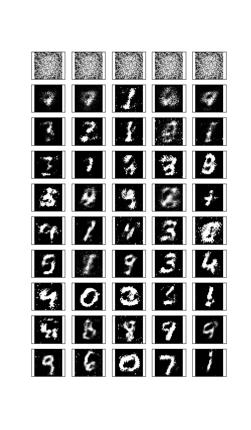

# Generating Mnist digits with a GAN

## Progress during training (200 epochs)

## Acknowledgements
Most of the code comes from Udacity's deep learning repository [https://github.com/mchablani/deep-learning/blob/master/gan_mnist/Intro_to_GANs_Exercises.ipynb](https://github.com/mchablani/deep-learning/blob/master/gan_mnist/Intro_to_GANs_Exercises.ipynb)